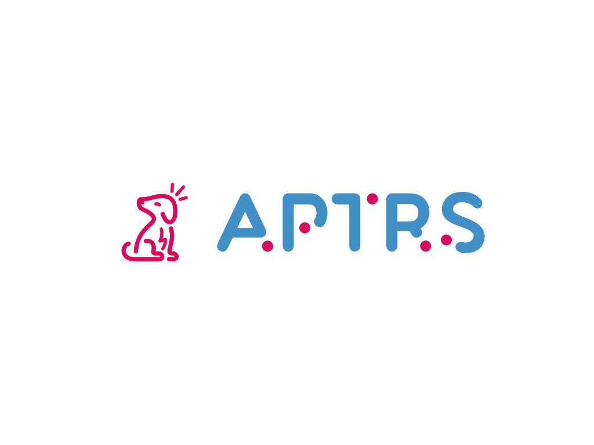

# Automated Penetration Testing Reporting System

APTRS (Automated Penetration Testing Reporting System) is a Python, Django and ViteJS-based automated reporting tool designed for penetration testers and security organizations. This tool streamlines the report generation process by enabling users to create PDF, Docx and Excel reports directly, eliminating the need for manual approaches. Additionally, APTRS offers a systematic way to monitor and manage vulnerabilities within various projects. Keep your penetration testing projects organized and efficient with APTRS.

